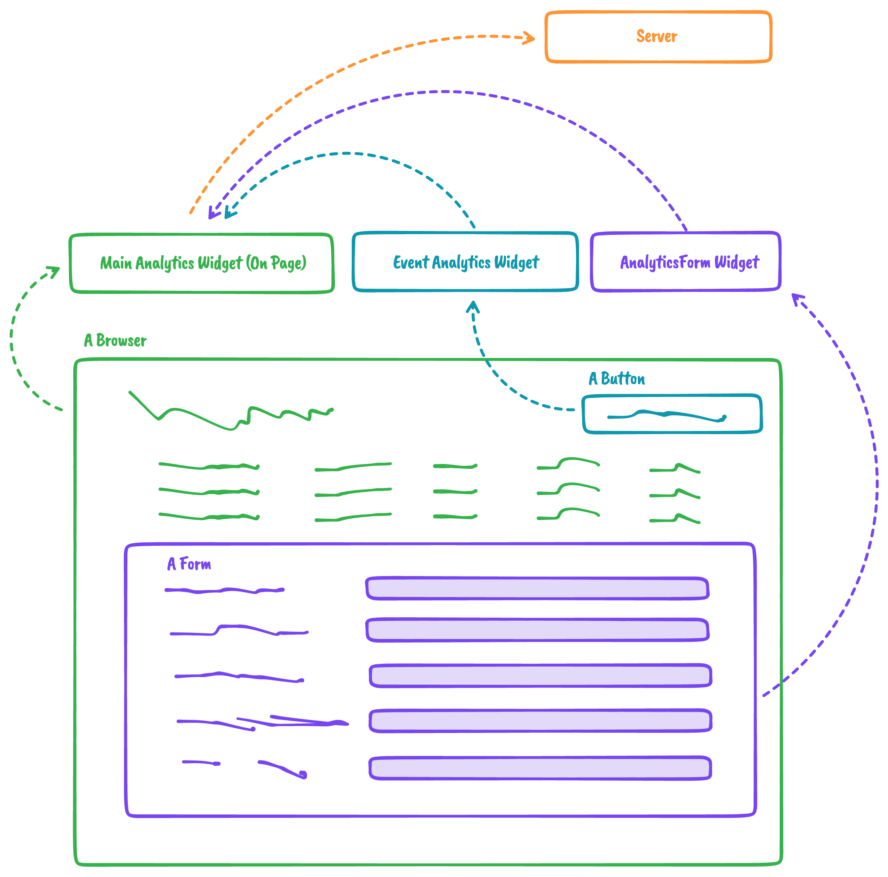

# Mendix Analytics Widget

For Questions please go to `#ask-the-appfactory` on slack



Main Analytics widget is the only widget that communicate to Mendix.

All auxiliary widgets communicate over `pub-sub` to the Main Analytics widget.

## Main Analytics

This widget is the main analytics widget - It does all the communication to mendix. Add this widget to a layout file that all app pages you want to track is based off of.

It currently does :

- **User Data**: That contain data:

```
    didUserReload: boolean;
    userAgent: string;
    platform: string;
    language: string;
    startedDate: Date;
    userIDMX: string;
    isGuestMX: string;
```

- **Page Data**: That contain data:

```
    startDate: Date;
    leaveDate: Date | undefined;
    pathName: string;
    uuid: string;
    duration: number | undefined;
    loadTime: number;
```

- **Event Data**: That contain data:

```
    groupId: string;
    _id: string;
    type: EClassNamePayloadType;
    className: string;
    friendlyName: string;
    dateAdded: Date;
    dateLastClicked: Date | null;
    pageId: string | undefined;
    clicked: number;
```

- **Event Listener**: Listens to Widget Analytics Class Widget for Events: Pubsub token: `CLASSNAME_MENDIX_LISTENER`
- **Timer Listener**: Listens to Widget Analytics Form Widget for Events: Pubsub token: `TIMER_MENDIX_LISTENER` **(Removed)**

## Event Analytics

Dispatches Events via PUB_SUB to Main analytics Widget

Event Widget can listen for events on Button Clicks defined by class names

### Setup Event


### Implementation Event


## Form Analytics

Adds an event listner to form inputs, and will link them to a page, and will add data like when user went to what input and in what order.

## Inspiration

https://engineering.linkedin.com/blog/2017/02/measuring-and-optimizing-performance-of-single-page-applications

## Details

### Raw Capture

We Capture On a User Session :

- Platform of User
- Did user Reload ever
- Language
- Start Date
- Is Guest
- Pages Visited
- Load time of Page
- Start Time
- Leave Time
- Duration
- Page Name
- Events On Page (Separate Widget)
- Listens for Clicks on Class Names.
- Count Clicks
- Time Of Click

---

### Rationalized Data

All this data could be Rationalized to View exact flow of one user through the app.

**or**

Used to see what are the most viewed pages, most abandoned pages, most clicked buttons, how many users reload the app, how many guests, how many are english, dutch ect. average duration of user, when most users use app (time)
And prob more.

---
